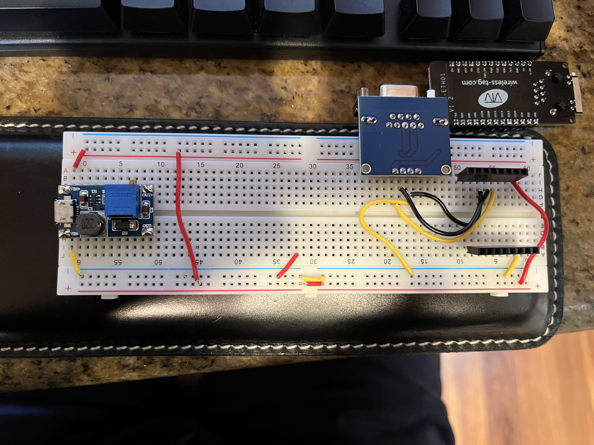

# Monoprice 6ch Audio Receiver - ESP Home Interface
This is an ESP32 to RS232 adapter for the Monoprice 6ch Whole Home Audio Amplifier.

It has support for both a serial-socket interface (to support the existing iOS apps / HomeAssisstant integration) as well as direct control via ESPHome (via web-server ui, or via HomeAssistant API/Mqtt).

I currently have it configured to also have a relay and a 12V trigger onboard, to control the PA functionality.

Shortly, I hope to have designs for a PCB, with a list to all the parts I've used, to create your own. 

You need a null-model (crossed pins) Male-Male cord to connect. Amazingly, these are hard to find. The combination below yiels cables for ~$6 each

1. ESP: https://smile.amazon.com/gp/product/B099PDG16B
1. Power (provides 5V for ESP, and 12V boosted for trigger): https://smile.amazon.com/gp/product/B08R5LMQH1
1. Serial breakout: https://smile.amazon.com/gp/product/B07Z5Y1WKX
1. Serial cable (straight through, M-F): https://smile.amazon.com/gp/product/B081GHYHPR
1. Serial null-modem adapter (M-M): https://smile.amazon.com/gp/product/B01HMNIYJQ

