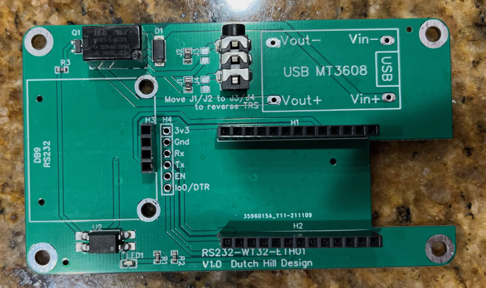
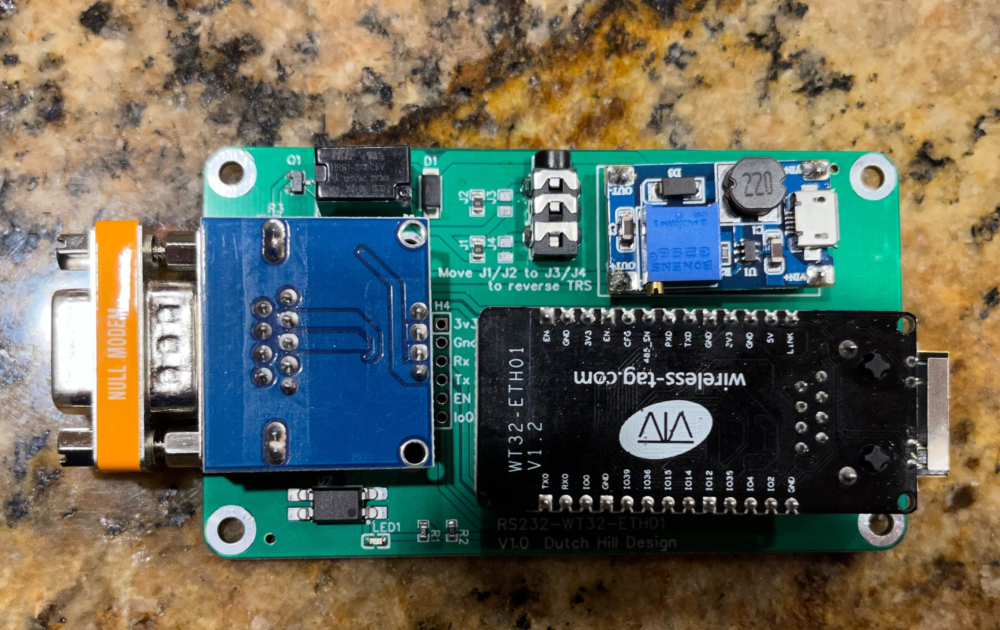
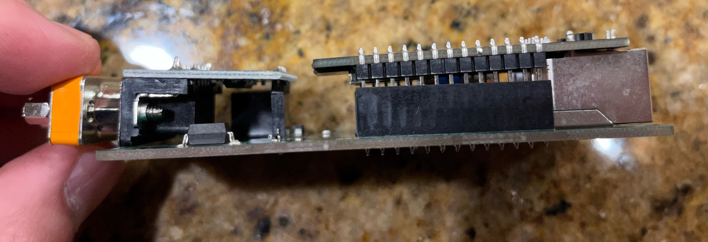
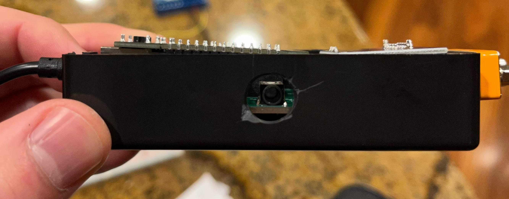
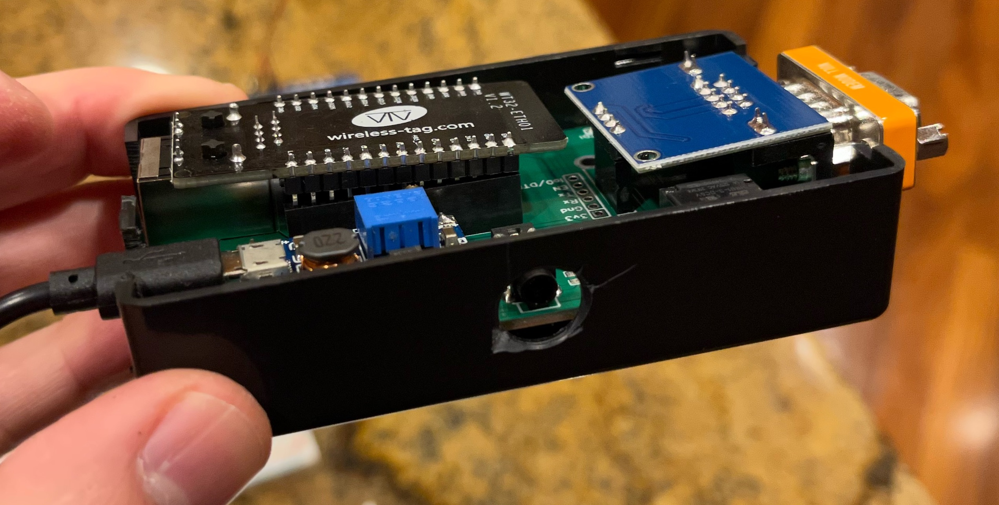

# Monoprice 6ch Audio Receiver - ESP Home Interface
This is an ESP32 to RS232 adapter for the Monoprice 6ch Whole Home Audio Amplifier.

It has support for both a serial-socket interface (to support the existing iOS apps / HomeAssisstant integration) as well as direct control via ESPHome (via web-server ui, or via HomeAssistant API/Mqtt).

I currently have it configured to also have a relay and a 12V trigger onboard, to control the PA functionality. However, this could just be done via software as well.

I made an initial run of 5 PCBs via JLCPCB (total cost: $22 shipped), with all of the non-modules listed below presoldered. It works excellently electrically. Physically, I needed to expand the cutout for the ethernet port, and add a small cutout for the RS232 (done).

[You can find my schematic here](https://easyeda.com/johhen/monoprice_controller)

Additional changes that would make it better:
1. Place 3.5MM next to WT32 port, so that it comes out in parallel to the ethernet cable.
2. Arrange the USB boost converter so that the cable can come out besides the null modem adapter.
3. Relayout around making a custom 3d printed enclosure. I was trying to fit in 100x60x25mm Project Box, but I think that even if I had the cutouts properly, it'd still be ~2mm too tall. Right now, it wont take the lid.

Additionally, ESPHome has a bug currently where the WebUI for ESPHome won't show the values for all the sensors, if you have a boatload of them. Not a problem if you just use the HA integration.

If you'd like a PCB + the breakouts I've listed below, please reach out! I will distribute at cost.

You need a null-model (crossed pins) Male-Male cord to connect. Amazingly, these are hard to find. The combination below yields cables for ~$6 each

1. ESP: https://smile.amazon.com/gp/product/B099PDG16B
2. Power (provides 5V for ESP, and 12V boosted for trigger): https://smile.amazon.com/gp/product/B08R5LMQH1
3. Serial breakout: https://smile.amazon.com/gp/product/B07Z5Y1WKX
4. Serial cable (straight through, M-F): https://smile.amazon.com/gp/product/B081GHYHPR
5. Serial null-modem adapter (M-M): https://smile.amazon.com/gp/product/B01HMNIYJQ

## Pictures
### Breadboard Version

### Bare PCB

### With Modules

### Cutouts aren't big enough

### Too Tall in the case

### Another in-case shot

### SO MANY ENTITIEs

